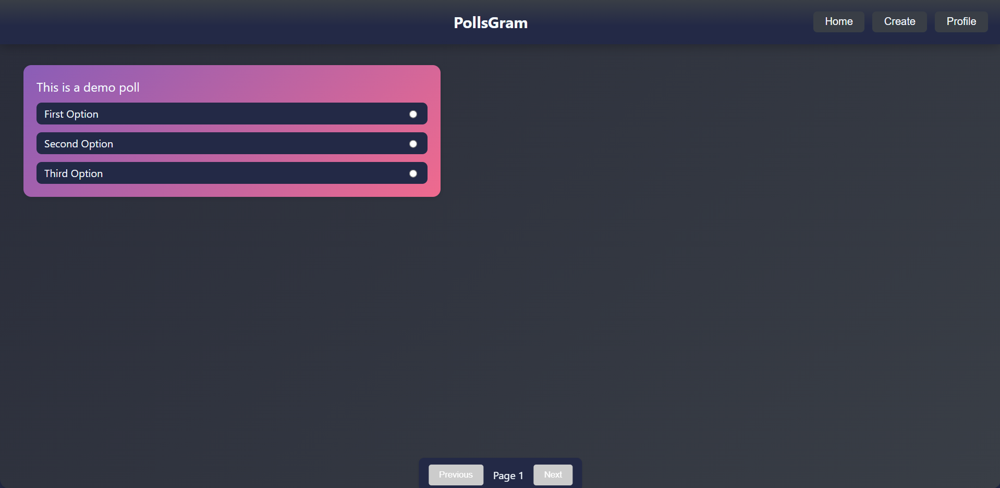

# PollsGram

PollsGram is a full-stack web application that allows users to create, share, and vote on polls. It features a modern, responsive frontend built with React and a robust backend powered by Spring Boot.



## Features

-   **Google Authentication**: Secure and easy login/signup using Google accounts.
-   **Create Polls**: Authenticated users can create new polls with multiple options.
-   **Vote on Polls**: Users can cast their vote on any poll. The application prevents duplicate voting.
-   **View Polls**: A paginated view of all available polls.
-   **User Profile**: A dedicated profile page where users can see all the polls they have created and log out.
-   **Delete Polls**: Users can delete polls they have created.
-   **JWT-based API Security**: The backend API is secured using JSON Web Tokens (JWT) with a refresh token mechanism for persistent sessions.

## Technologies Used

-   **Backend**:
    -   Java 21
    -   Spring Boot 3
    -   Spring Data JPA
    -   Spring Security
    -   MySQL
    -   JSON Web Tokens (JWT)
    -   Gradle
-   **Frontend**:
    -   React 19
    -   TypeScript
    -   Vite
    -   Axios
    -   React Router
    -   React Toastify
    -   Google OAuth 2.0 Library

## Project Structure

The repository is organized into two main directories:

-   `Backend/`: Contains the Spring Boot application.
-   `Frontend/`: Contains the React single-page application.

## Getting Started

Follow these instructions to get a local copy up and running.

### Prerequisites

-   **Java Development Kit (JDK)**: Version 21 or later.
-   **Node.js**: Version 18 or later.
-   **MySQL**: A running instance of MySQL database.
-   **Google OAuth Client ID**: You will need to create a project in the [Google Cloud Console](https://console.cloud.google.com/) and obtain an OAuth 2.0 Client ID.

### Backend Setup

1.  **Navigate to the backend directory:**
    ```sh
    cd Backend/PollsGram
    ```

2.  **Create Configuration Files:**
    You need to create four configuration files in the `src/main/resources/` directory.

    -   **`application.properties`**: This is the main configuration file.
        ````properties
        // filepath: Backend/PollsGram/src/main/resources/application.properties
        spring.datasource.url=jdbc:mysql://localhost:3306/your_database_name
        spring.datasource.username=your_mysql_username
        spring.datasource.password=your_mysql_password
        spring.jpa.hibernate.ddl-auto=update
        spring.datasource.driver-class-name=com.mysql.cj.jdbc.Driver
        spring.security.oauth2.client.registration.google.client-id=YOUR_GOOGLE_CLIENT_ID.apps.googleusercontent.com
        spring.security.oauth2.client.registration.google.client-secret=YOUR_GOOGLE_CLIENT_SECRET
        spring.profiles.active=dev
        ````

    -   **`application-dev.properties`**: For development environment settings.
        ````properties
        // filepath: Backend/PollsGram/src/main/resources/application-dev.properties
        overhttps=false
        ````

    -   **`application-prod.properties`**: For production environment settings.
        ````properties
        // filepath: Backend/PollsGram/src/main/resources/application-prod.properties
        overhttps=true
        ````

    -   **`.env`**: For sensitive environment variables like the JWT secret.
        ````
        // filepath: Backend/PollsGram/.env
        JWT_SECRET=your_super_secret_jwt_key_that_is_long_and_random
        ````

3.  **Run the backend server:**
    ```sh
    ./gradlew bootRun
    ```
    The server will start on `http://localhost:8080`.

### Frontend Setup

1.  **Navigate to the frontend directory:**
    ```sh
    cd Frontend/PollsGram
    ```

2.  **Install dependencies:**
    ```sh
    npm install
    ```

3.  **Create Environment File:**
    Create a `.env` file in the `Frontend/PollsGram` directory and add your Google Client ID.

    ````
    // filepath: Frontend/PollsGram/.env
    VITE_BASE_API_URL=http://localhost:8080
    VITE_GOOGLE_CLIENT_ID=YOUR_GOOGLE_CLIENT_ID.apps.googleusercontent.com
    ````

4.  **Run the frontend development server:**
    ```sh
    npm run dev
    ```
    The application will be available